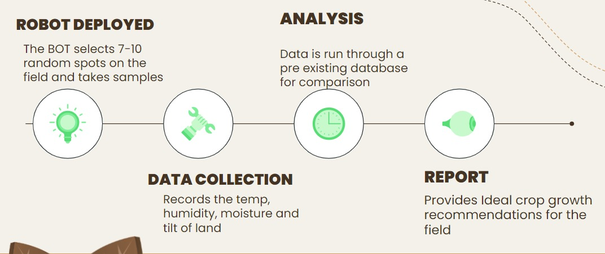

## Agraid

Built during [Hackstack 1.0](https://hackstack.infrastack-labs.com)

## Problem Statement
According to a study in 2018, the agricultural sector employed about 50% of the workforce yet only contributed to 17-18% of India’s overall GDP. Soil testing can be a tedious task, inaccurate manual analysis could lead to loss of crops and low productivity infertility of soil.

## Solution
To determine the soil characteristics we require the use of a robot crane with sensors such as NPK, temperature, humidity, tilt and moisture. The measured data is run through machine learning model and a report is produced which determines the best crop to grow in the given soil

https://user-images.githubusercontent.com/27956426/194697758-557e2424-4905-4786-808d-87d2361a4efc.mp4

**Members**

 - [Anushka Ghei](https://github.com/Anushkaghei)
 - [Dhriti Krishnan](https://github.com/dhritikrishnan)
 - [Raunak Kodwani](https://github.com/kanuar)
 - [Adithya S Kolavi](https://github.com/adithya-s-k)
